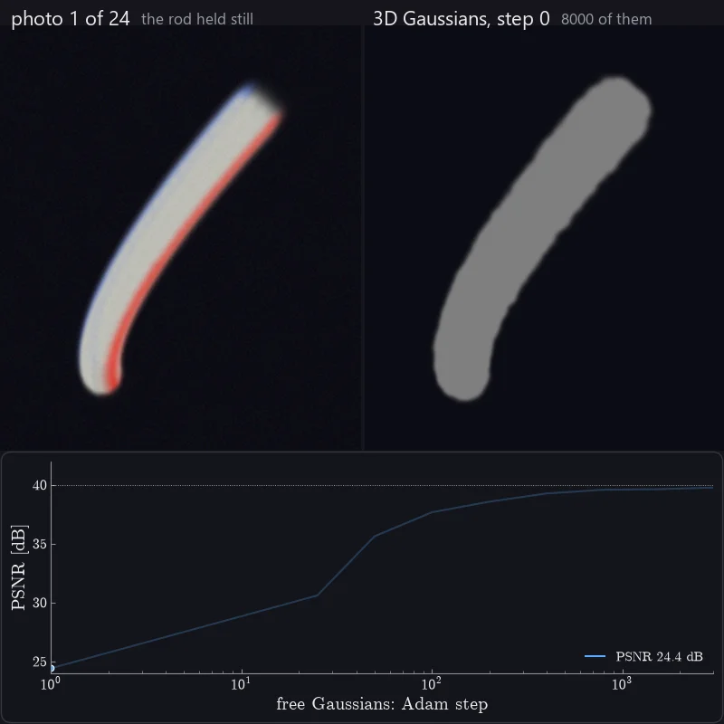

# DiSMech-Newton

[](https://pypi.org/project/dismech-newton/)
[](https://opensource.org/license/gpl-3.0)


Discrete elastic rods for [NVIDIA Newton](https://github.com/newton-physics/newton).

- **`ADMMDiSMechSolver`**: implicit DER solved with ADMM, inspired by
  [Daviet (2023)](https://research.nvidia.com/labs/prl/admm_hair/), with rod-rod, rod-shape and
  rod-ground contact and Coulomb friction.
- **`DiSMechSolver`**: implicit DER solved with Newton-Raphson.

## Examples

<table>
  <tr>
    <th width="33%">Cantilever</th>
    <th width="33%">Overhand Knot</th>
    <th width="33%">Plectoneme</th>
  </tr>
  <tr>
    <td></td>
    <td></td>
    <td></td>
  </tr>
  <tr>
    <td valign="top">DER (top) and Newton's VBD (bottom) against Euler-Bernoulli.<br><code>uv run examples/cantilever.py</code></td>
    <td valign="top">A knot pulled tight with friction <a href="https://doi.org/10.1103/PhysRevLett.99.164301">Audoly et al. (2007)</a>.<br><code>uv run examples/overhand_knot.py</code></td>
    <td valign="top">A twisted rod coils into a plectoneme <a href="https://doi.org/10.1016/j.bpj.2009.02.032">Clauvelin et al. (2009)</a>.<br><code>uv run examples/plectoneme.py</code></td>
  </tr>
  <tr>
    <th width="33%">Flagella Bundling</th>
    <th width="33%">System Identification</th>
    <th width="33%">RGB-D Capture</th>
  </tr>
  <tr>
    <td></td>
    <td></td>
    <td></td>
  </tr>
  <tr>
    <td valign="top">Flagella bundle in a viscous fluid <a href="https://arxiv.org/abs/2205.10309">Tong et al. (2022)</a>.<br><code>uv run examples/flagella.py --flagella 10</code></td>
    <td valign="top">L-BFGS fits parameters from positions and a gripper force sensor.<br><code>uv run examples/fit_buckling.py</code></td>
    <td valign="top">Fitting rod geometry and parameters from a single RGB-D camera.<br><code>uv run --extra splat examples/fit_capture.py</code></td>
  </tr>
</table>

## Install

Requires Python 3.10+. Runs on an NVIDIA GPU with CUDA 13 or on the CPU.

```bash
pip install "dismech-newton[gpu]"
```
