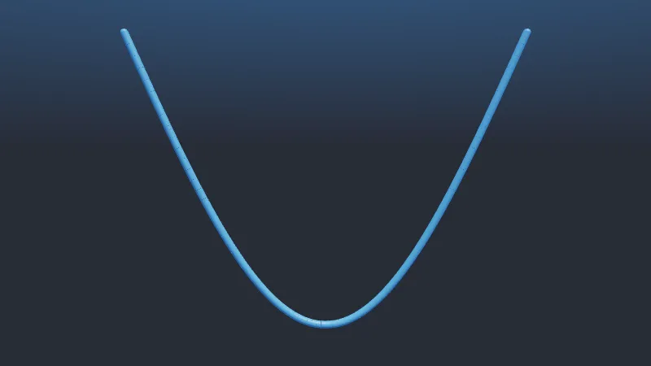

# dismech-newton

[](https://opensource.org/license/gpl-3.0)

Discrete elastic rods for [Newton](https://github.com/newton-physics/newton): a Newton-Raphson solver
(`DiSMechSolver`) and an ADMM solver with contact and friction (`ADMMDiSMechSolver`). Requires an NVIDIA GPU with CUDA 13.

## Quick install

```bash
git clone https://github.com/ryanchaiyakul/dismech-newton.git
cd dismech-newton
uv sync --extra gpu --extra viewer
uv run examples/cantilever.py
```

## Examples

<table>
  <tr>
    <th>Plectoneme</th>
    <th>Overhand knot</th>
  </tr>
  <tr>
    <td></td>
    <td></td>
  </tr>
  <tr>
    <td align="center"><code>uv run examples/cable_plectoneme.py</code></td>
    <td align="center"><code>uv run examples/overhand_knot.py</code></td>
  </tr>
  <tr>
    <th colspan="2">Cantilever</th>
  </tr>
  <tr>
    <td colspan="2"></td>
  </tr>
  <tr>
    <td colspan="2" align="center"><code>uv run examples/cantilever.py</code><br>
    </td>
  </tr>
</table>
