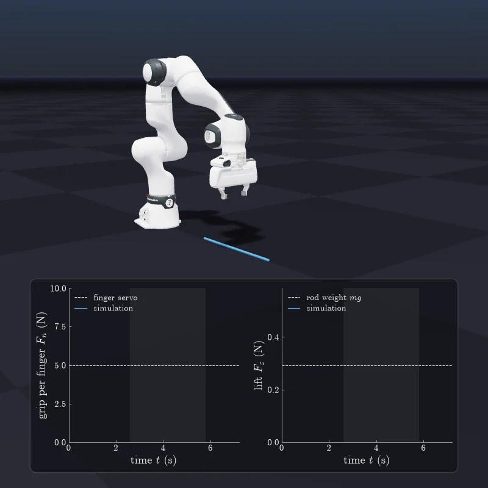
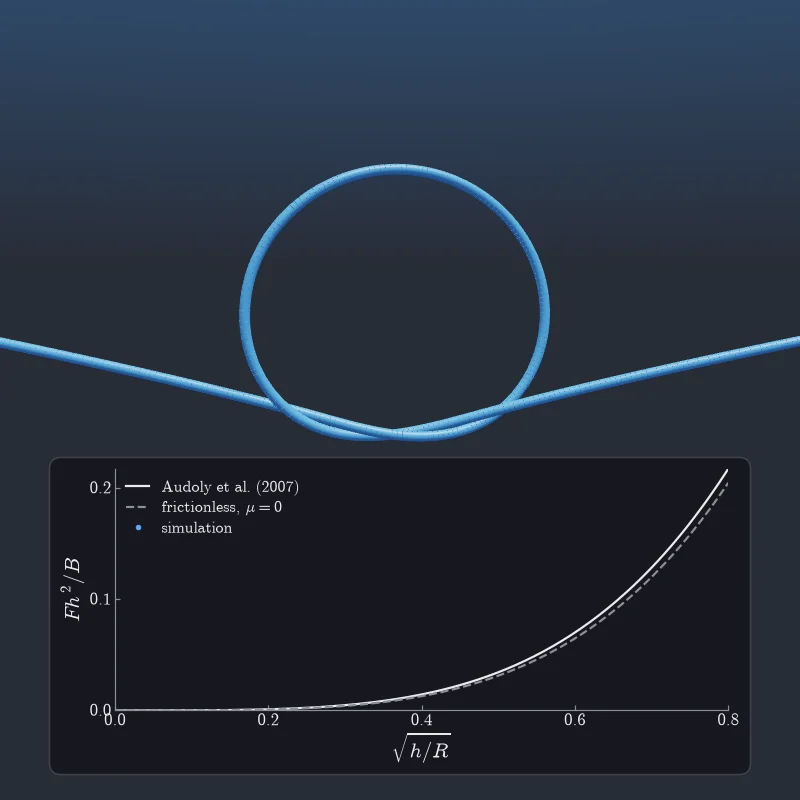
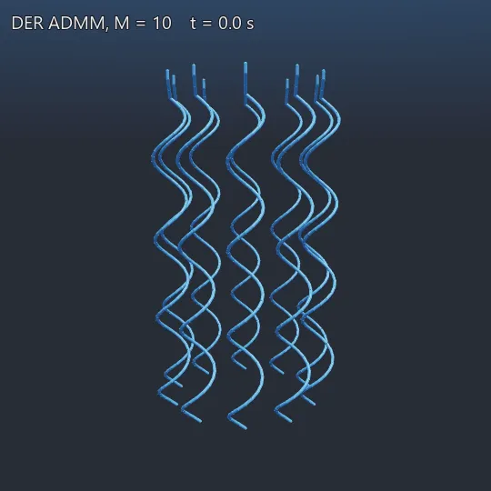
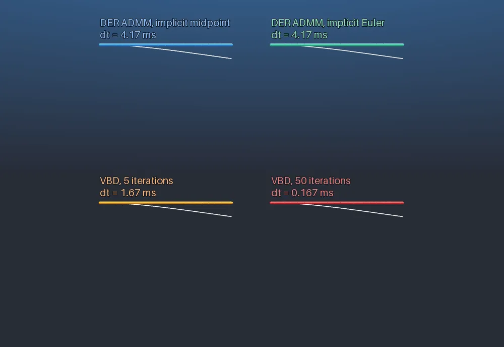
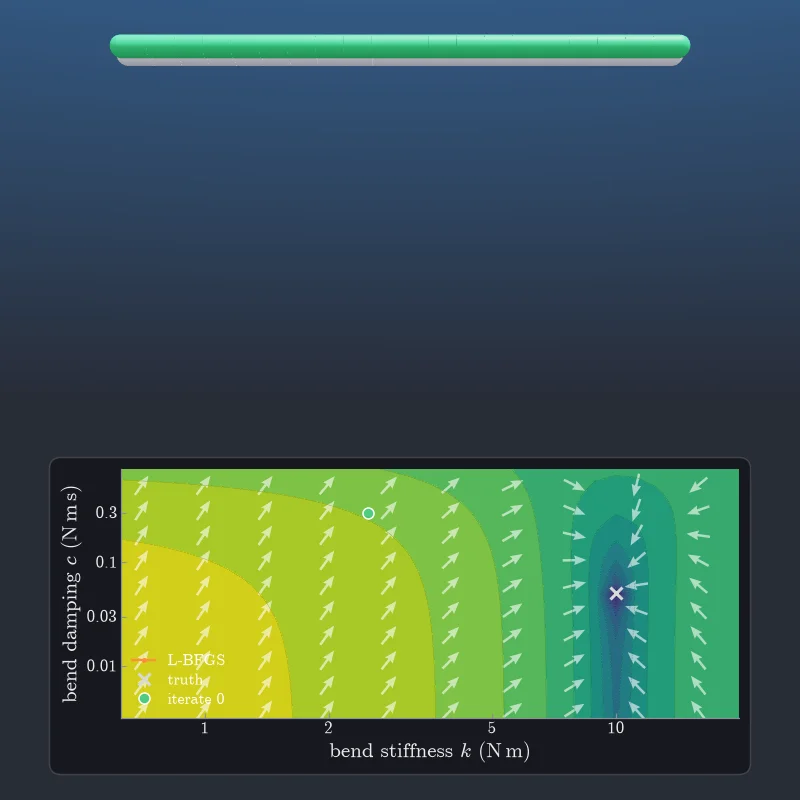

# DiSMech-Newton

[](https://opensource.org/license/gpl-3.0)


Discrete elastic rods for [NVIDIA Newton](https://github.com/newton-physics/newton).

- **`ADMMDiSMechSolver`**: implicit DER solved with ADMM, inspired by
  [Daviet (2023)](https://research.nvidia.com/labs/prl/admm_hair/), with rod-rod, rod-shape and
  rod-ground contact and Coulomb friction.
- **`DiSMechSolver`**: implicit DER solved with Newton-Raphson.

## Examples

<table>
  <tr>
    <th>Two-way Coupled Solvers</th>
    <th>Overhand knot</th>
  </tr>
  <tr>
    <td></td>
    <td></td>
  </tr>
  <tr>
    <td>MuJoCo simulated Franka arm carrying a rod.<br>
    <code>uv run --extra mujoco examples/franka_rod.py</code><br>
    <td>A loose overhand knot is pulled tight with friction <a href="https://doi.org/10.1103/PhysRevLett.99.164301">Audoly et al. (2007)</a>.<br>
    <code>uv run examples/overhand_knot.py</code><br>
  </tr>
  <tr>
    <th>Flagella bundling</th>
    <th>Cantilever</th>
  </tr>
  <tr>
    <td></td>
    <td></td>
  </tr>
  <tr>
    <td>Ten helical flagella spin in a viscous fluid and bundle <a href="https://arxiv.org/abs/2205.10309">Tong et al. (2022)</a>.<br>
    <code>uv run examples/flagella.py --flagella 10</code><br>
    <td>A clamped rod sags under gravity, next to Newton's VBD cable and the Euler-Bernoulli curve.<br>
    <code>uv run examples/cantilever.py</code><br>
  </tr>
  <tr>
    <th colspan="2">Gradient Optimization</th>
  </tr>
  <tr>
    <td colspan="2"></td>
  </tr>
  <tr>
    <td colspan="2">L-BFGS fits a cantilever's bending stiffness and damping to an observed motion, with gradients through the solver. Each iteration (green) beside the truth (grey), with its path on the loss landscape.<br>
    <code>uv run examples/fit_stiffness.py</code><br>
  </tr>
</table>

## Install

Requires an NVIDIA GPU with CUDA 13, Python 3.10+ and [uv](https://docs.astral.sh/uv/).

```bash
git clone https://github.com/ryanchaiyakul/dismech-newton.git
cd dismech-newton
uv sync --extra gpu --extra viewer
uv run examples/cantilever.py
```
